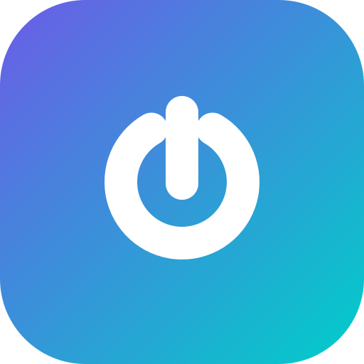
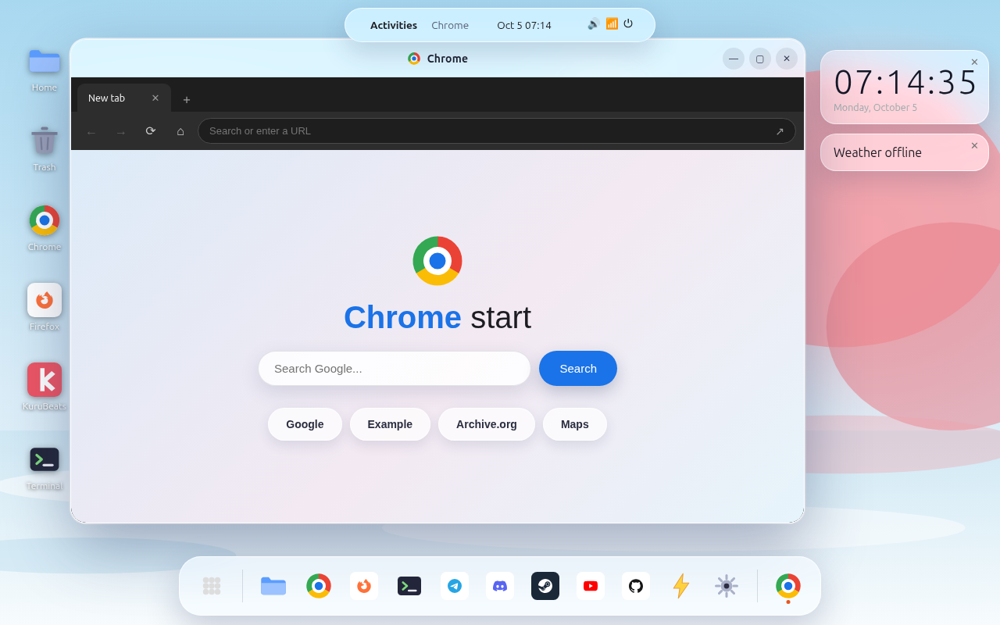

<p align="center">
  
</p>

<h1 align="center">myOS</h1>

<p align="center">
  A full desktop operating system that runs in your browser.<br>
  One HTML file. No install, no build step, no dependencies.
</p>

<p align="center">
  <a href="https://kurupdevs.github.io/my-os/"><b>Try it live</b></a>
  ·
  <a href="https://github.com/kurupdevs/my-os/releases/latest">Android APK</a>
  ·
  <a href="INSTALL.md">Install guide</a>
</p>

---



## What is this

myOS is a web-based desktop OS. Open `index.html` (or the live link above) and you get a working desktop: taskbar, start menu, windows you can drag/minimize/maximize, a terminal, browsers, a music player, office apps, games utilities — the works.

It's all client-side. Your files, notes and settings stay in your browser's local storage. Nothing is uploaded anywhere.

## Features

- **Real desktop** — draggable windows, minimize/maximize/close, taskbar with running apps, start menu with search and categories, right-click context menus, draggable desktop icons
- **Browsers** — Chrome, Firefox and Edge skins with tabs, history, bookmarks, and an address bar that searches Google or opens URLs. YouTube search and playback built in
- **Terminal** — a `kurupdevs` CLI with `neofetch`, file commands, themes and easter eggs
- **KuruBeats** — built-in music player with visualizer, playlist and seek
- **Office** — Excel, Word and PowerPoint (real Microsoft 365 web apps), Text Editor, Notes, Typing Tutor
- **Creative** — Paint (draw + save PNG), Image Viewer, Wallpapers
- **Internet apps** — Telegram, Discord, Steam, GitHub client, YouTube, Radio (live SomaFM stations)
- **System** — Files, Calculator, Settings (themes, wallpapers, clock), Trash, SmartClean
- **Power menu** — shutdown and restart play a proper sequence, lock screen included

## Run it

Easiest way — just open the live site:

**https://kurupdevs.github.io/my-os/**

Or grab `index.html` from this repo (or the latest release) and double-click it. Works offline except for the bits that need the internet (web browsing, radio, weather).

Full Windows / Linux / Android instructions are in [INSTALL.md](INSTALL.md).

## Project layout

```
my-os/
├── index.html                  # the whole OS, single self-contained file
├── logo.svg                    # project logo
├── screenshot.png              # desktop screenshot
├── INSTALL.md                  # install tutorial (Windows / Linux / Android)
└── android/                    # native Android wrapper (WebView, landscape, fullscreen)
    ├── app/src/main/...        # MainActivity, manifest, launcher icons
    └── ...
.github/workflows/build-apk.yml  # builds the APK automatically on every v* tag
```

The `android/` folder is a thin native shell — it just loads `index.html` in a fullscreen WebView. The APK is built by GitHub Actions and attached to each release, so you never have to build it yourself.

## Notes

- The file is big (~48 MB) because the music tracks, videos and wallpapers are embedded directly — that's what makes it work offline as a single file.
- Some websites refuse to be embedded in iframes (that's their choice, not a bug) — the browsers fall back to opening those in a new tab.
- YouTube search uses public API instances; if one is down it tries the next, and every video page has a one-tap "open in YouTube app" fallback.

Made by [kurupdevs](https://github.com/kurupdevs).
